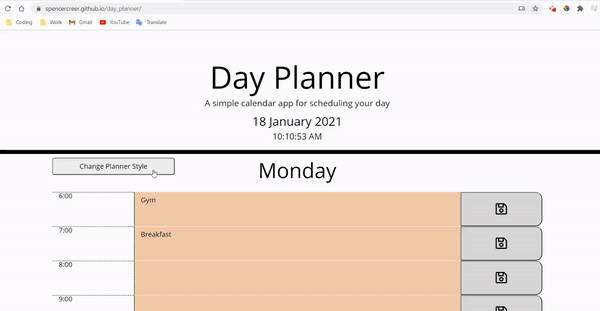

# Day Planner

## Description
A simple daily planner application that allows the user to schedule events hourly. The current date and time are displayed using JavaScript date methods. The planner timeblocks are dynamically created using template literals. This application features day and night CSS styling which can be changed by clicking the "Change Planner Style" button.

## Table of Contents
* [Links](#links)
* [Animation](#animation)  
* [Instructions](#instructions) 
* [Technologies](#technologies)  
* [License](#license)
* [Contact](#contact)

## Links
Published URL: [https://spencercreer.github.io/day_planner/](https://spencercreer.github.io/day_planner/)

Repository: [https://github.com/spencercreer/day_planner](https://github.com/spencercreer/day_planner)

## Animation
The following animation demonstrates the application functionality:

## Instructions
The user may enter events within each text area and save them by clicking the cooresponding save button. When the user clicks the save button, the contents of the text area are stored to local storage. The contents of local storage are recalled to each text area when the application is refreshed.

## Contribute
Please submit a PR if you would like to contribute.

## Technologies
 * JavaScript
 * HTML
 * CSS
 * Bootstrap
 * jQuery

## License
This project is licensed under the MIT license.

## Contact
For questions or comments, please contact me.

Email: <a href="mailto: spencercreer@gmail.com" target="_blank">spencercreer@gmail.com</a>

GitHub: [spencercreer](https://github.com/spencercreer/)
